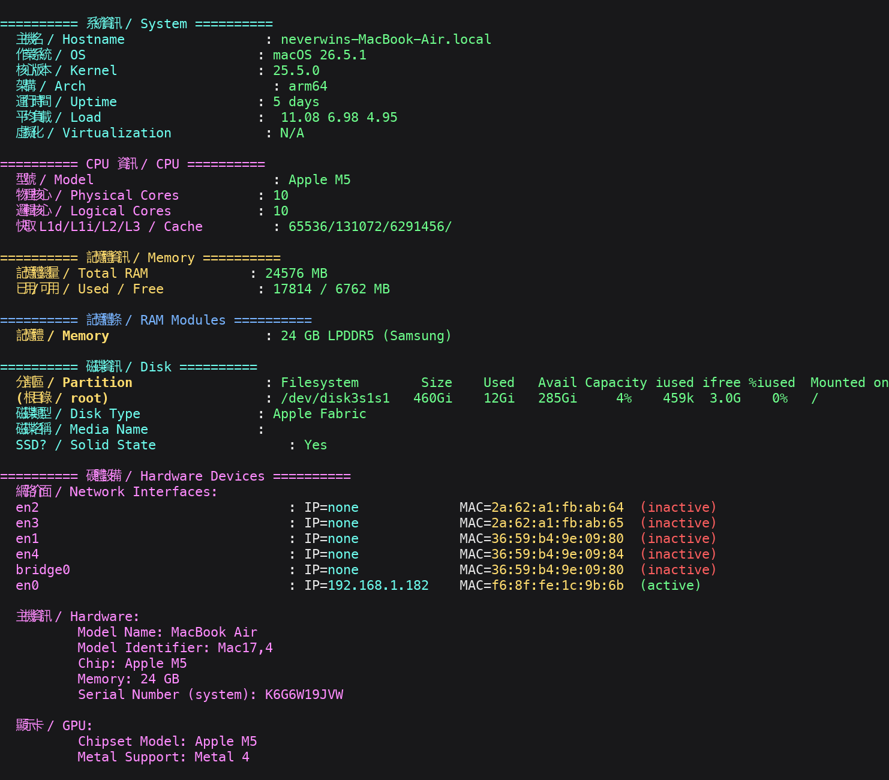

# SysInfo — 一鍵系統資訊蒐集 / 品牌型號查詢 / 超開檢測 / 基準測試

**SysInfo** 是一個單一檔案的 Bash 腳本，在 **Linux** 與 **macOS** 上執行，幫你一次蒐集完整硬體與系統資訊：

- 系統資訊（作業系統、核心、架構、負載、虛擬化）
- CPU 資訊（型號、實體/邏輯核心、快取、頻率、指令集）
- 記憶體資訊（總量、使用量、交換空間）
- 記憶體條資訊（每條容量、類型、頻率、廠商、型號）
- 磁碟資訊（分割區、磁碟類型、型號）
- 硬體設備（網路介面 IP/MAC、顯示卡）
- **品牌型號查詢**（CPU / GPU / 主機板 / BIOS 具體型號與版本、記憶體頻率）
- **超開檢測**（CPU 快取、Steal 時間、記憶體超開、vCPU 超開 — 適合判斷 VPS 是否被超售）
- CPU 基準測試（sysbench / openssl）
- 磁碟 I/O 基準測試

適用於：**物理機、VM、VPS、雲端主機**皆可執行。

---

## 快速開始

直接在本機執行：

```bash
curl -fsSL https://sys.nev3rw1n.com/ | bash
```

或下載後執行：

```bash
bash <(curl -fsSL https://sys.nev3rw1n.com/)
```

也可以直接抓原始檔：

```bash
curl -fsSL https://sys.nev3rw1n.com/ -o sysinfo.sh
bash sysinfo.sh
```

> 本專案同時佈署於 GitHub Pages，原始檔亦位於 repo 根目錄 `index.html`（Bash 腳本）。

---

## 執行畫面



---

## 功能詳情

| 區段 | 說明 | Linux | macOS |
|------|------|:-----:|:-----:|
| 系統資訊 / System | OS、Kernel、Arch、Uptime、Load、虛擬化 | ✅ | ✅ |
| CPU 資訊 / CPU | 型號、實體/邏輯核心、快取、頻率、關鍵指令集 | ✅ | ✅ |
| 記憶體資訊 / Memory | 總量、已用、可用、Swap | ✅ | ✅ |
| 記憶體條 / RAM Modules | 每條容量、類型、頻率、廠商、型號 | ✅（需 root/dmidecode） | ✅ |
| 磁碟資訊 / Disk | 分割區、SSD/HDD 類型、型號 | ✅ | ✅ |
| 硬體設備 / Devices | 網路介面 IP/MAC、顯示卡、主機資訊 | ✅ | ✅ |
| **品牌型號 / Brand & Model** | **CPU/GPU/主機板/BIOS 具體型號與版本、記憶體頻率** | ✅ | ✅ |
| 超開檢測 / Oversell | CPU 快取、Steal、記憶體、vCPU 超開判斷 | ✅ | 不支援 |
| CPU 基準測試 | sysbench / openssl speed | ✅ | ✅ |
| 磁碟 I/O | 1G direct 讀寫 | ✅ | 跳過（避免影響系統） |

---

## 品牌型號查詢（Brand & Model）

可查詢各硬體元件的具體型號與版本：

- **CPU**：廠商（vendor）、型號、Family/Model/Stepping、微碼（Microcode）
- **GPU**：完整型號與修訂版
- **主機板**：製造商、產品型號、版本（`dmidecode -t baseboard`，需 root）
- **BIOS / 韌體**：Vendor、版本、發布日期（Linux）；System Firmware Version（macOS）
- **記憶體**：各頻率模組數量（如 `2 x 16GB @ 5600 MT/s`）

macOS 上另顯示：CPU Chip、機型（Model Identifier）、GPU 廠商、記憶體類型與速度。

---

## 超開檢測（Oversell Detection）

針對 VPS / 雲主機常見的超售（oversell）現象進行多項指標檢查：

1. **CPU 快取大小** — 快取為 0 時強烈暗示 CPU 被超開
2. **vCPU Steal 時間** — 1 秒取樣，>=20% 嚴重、10~20% 可能超開、5~10% 輕度競爭
3. **記憶體分配 vs 物理記憶體** — 系統可見記憶體大於物理記憶體即為異常
4. **vCPU 數量 vs 實體核心** — 超過「實體核心 × 每核執行緒」即提示風險

> 此為輔助判斷工具，結果受虛擬化技術與檢測權限影響，請自行評估。

---

## 需求

- **Linux**：`bash`、`lscpu`、`free`；品牌型號與記憶體條查詢需 `dmidecode`（建議以 root / sudo 執行）
- **macOS**：`system_profiler`（內建）
- **基準測試**：`sysbench`（建議）或 `openssl`
- **磁碟 I/O**：`dd`、`lsblk`（Linux）

無需任何套件安裝即可顯示大部分資訊。

---

## 原始碼

原始碼為單一檔案，可直接閱讀與修改：

- `index.html` — 完整 Bash 腳本（佈署於 GitHub Pages）
- `CNAME` — GitHub Pages 自訂網域設定

本專案由 **bench.sh** 演進而來，屬於原「系統資訊蒐集 + 基準測試」工具，並加入品牌型號查詢與超開檢測功能。

---

## 授權

MIT License — 可自由使用、修改與散佈。

---

## 關鍵字

system info, sysinfo, 系統資訊, benchmark, 基準測試, VPS 檢測, 超開檢測, oversell detection, CPU info, GPU info, motherboard, BIOS, 主機板, 記憶體頻率, RAM speed, dmidecode, lscpu, Linux, macOS, curl, bash 腳本, 一鍵腳本, system profiler
